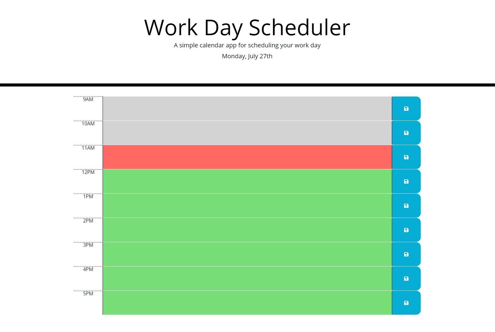

# work-day-scheduler
This application is a daily planner which uses javascript to save text input and display it within the planner.

To use the application the user must enter text into the different time block sections. Once entered the user clicks the save button which saves the input into the browser storage. If the webpage is reloaded the text is then added to the textarea.

Here is a link to the working file: https://wilsoncollin7.github.io/work-day-scheduler/

snap of the application:

